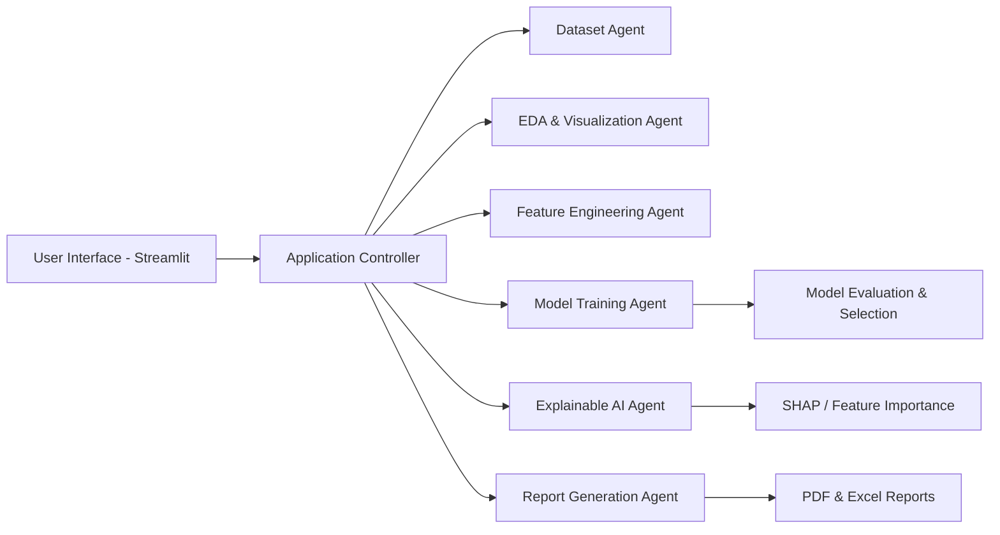

# AutoDS Agent – AI-Powered Autonomous Data Science Platform

AutoDS Agent is an intelligent, end-to-end autonomous data science platform designed to simplify and accelerate the machine learning workflow. Developed as an M.Sc. Data Science final year project, it combines data ingestion, preprocessing, exploratory data analysis, automated machine learning, explainable AI, and report generation into a single interactive system.

## 1. Project Description

AutoDS Agent empowers users to upload datasets, analyze data quality, build predictive models, compare algorithms, evaluate model performance, and generate business-ready reports with minimal manual effort. The platform is built to support students, researchers, and practitioners who want to explore machine learning workflows in a guided and automated way.

## 2. Features

- Dataset Upload
- Automated Data Cleaning
- Missing Value Detection
- Duplicate Detection
- Feature Engineering
- Automated EDA
- Interactive Visualizations
- AutoML
- Multiple ML Algorithms
- Model Comparison
- Best Model Selection
- Feature Importance
- Trust Score
- Health Score
- AI Executive Summary
- PDF Report Generation
- Excel Report Generation
- Deployment Readiness Analysis

## 3. System Architecture

The system follows a modular architecture where the frontend collects user input, the backend processes the data science workflow, and multiple intelligent agents coordinate tasks such as data cleaning, modeling, evaluation, and reporting.



## 4. Workflow

1. Upload a dataset.
2. Perform automated cleaning and quality analysis.
3. Generate exploratory visualizations and insights.
4. Engineer features and prepare training data.
5. Train and compare multiple models.
6. Select the best-performing model.
7. Generate explainability insights and AI-based summaries.
8. Produce deployment readiness and reporting outputs.

## 5. Technology Stack

### Frontend
- Streamlit

### Backend
- Python

### Libraries
- Pandas
- NumPy
- Scikit-learn
- Plotly
- Matplotlib
- SHAP
- ReportLab
- OpenPyXL

### Version Control
- Git
- GitHub

### Development Environment
- VS Code

## 6. Project Structure

```text
AutoDS-Agent/
├── app.py
├── config.py
├── agents/
├── api/
├── data/
├── reports/
├── tests/
├── utils/
├── requirements.txt
├── requirements-dev.txt
└── README.md
```

## 7. Installation

Clone the repository and install the required dependencies:

```bash
git clone <repo-url>
cd AutoDS-Agent
pip install -r requirements.txt
streamlit run app.py
```

## 8. Usage

Run the application locally using:

```bash
streamlit run app.py
```

Then upload your dataset through the web interface and follow the guided workflow to perform analysis, modeling, and reporting.

## 9. Screenshots

Screenshots will be added soon.

- Dashboard Preview: Coming Soon
- Model Comparison View: Coming Soon
- Report Generation View: Coming Soon

## 10. Machine Learning Pipeline

The platform supports a complete machine learning pipeline including:

- Data ingestion and validation
- Data cleaning and preprocessing
- Exploratory data analysis
- Feature engineering
- Model training and evaluation
- Model comparison and selection
- Performance reporting and deployment analysis

## 11. Explainable AI

AutoDS Agent integrates explainability techniques to improve transparency and trust in model predictions. Feature importance and interpretability insights are generated using SHAP and related visualization methods.

## 12. AI Report Generation

The system can generate automated reports that summarize:

- Dataset characteristics
- Data quality issues
- Model performance
- Feature importance
- Trust and health scores
- Executive summary for decision-making

Reports are available in PDF and Excel formats.

## 13. Deployment Readiness

The platform evaluates whether a trained model is suitable for deployment by analyzing:

- Model performance metrics
- Data quality stability
- Generalization potential
- Interpretability and trust indicators

## 14. Future Enhancements

Planned improvements include:

- Support for more advanced AutoML frameworks
- Integration with cloud-based training services
- Real-time monitoring and drift detection
- User authentication and multi-user access
- Enhanced dashboard customization

## 15. Contributors

This project was developed as part of an M.Sc. Data Science final year project.

## 16. License

This project is licensed under the MIT License. See the LICENSE file for more details.
